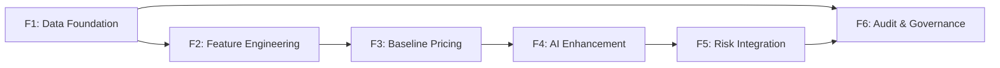

# GAINR PROTOCOL: Azure DevOps Board — Soccer Model Pipes
**Module:** Intelligence Layer L4 | **Version:** 3.0 (Validated) | **Date:** 2026-02-26

---

## 📋 Executive Overview

| Question | Answer |
|:---|:---|
| **What?** | The end-to-end AI pipeline for Soccer: ingesting Syndicate data, engineering features, calculating deterministic baseline odds, enhancing them with LORA/RAG AI, integrating risk guardrails with the Solana Treasury, and anchoring audit trails on-chain for GLI-33 compliance. |
| **Why?** | The Reserve Quoter on Solana **cannot function** without signed "Fair Value" quotes from this pipeline. Without it, pools have volatile odds (PRD REQ 3.2), the Treasury faces front-running (SRD §3.2), and the protocol fails GLI-33 audit (SRD §4). |
| **How?** | A Python FastAPI microservice (`gainr-ai-oracle`) that sits off-chain, consumes data from the Syndicate PGI adapter, and serves signed odds to the on-chain Betting Engine via REST + Ed25519 signatures. |
| **Who?** | Data Engineers, Data Scientists/Quants, MLOps Engineers, Backend Devs, Smart Contract/Crypto Engineers. |
| **Where?** | Off-chain compute (AWS/Azure GPU clusters) → REST API → Solana Settlement Layer (L5). |

---

## 🔍 Gap Analysis (Retrospective)

> Items identified by cross-referencing all source documents against the previous Epic draft.

| # | Gap Found | Source Document | Resolution in This Version |
|:---|:---|:---|:---|
| 1 | **No mention of `gainr-ai-oracle` FastAPI microservice** — the SRD and GOALS5 (S4.1) explicitly require a standalone Python FastAPI service. | [GOALS5.md](file:///d:/mBITS/GAINR_Protocol/GP/documents/WIP/GOALS5.md) S4.1, [Roadmap.md](file:///d:/mBITS/GAINR_Protocol/GP/documents/WIP/Roadmap.md) M4 | Added as foundational PBI in Feature 1. |
| 2 | **SportRadar dependency missing** — the SRD (§5) and Whitepaper list SportRadar as the official data provider. | [SRD.md](file:///d:/mBITS/GAINR_Protocol/GP/documents/WIP/SRD.md) §5, [WHITE_PAPER_ANALYSIS.md](file:///d:/mBITS/GAINR_Protocol/GP/documents/WIP/WHITE_PAPER_ANALYSIS.md) §4 | Added to Feature 2 and Feature 4 tasks. |
| 3 | **Chainlink Oracle integration not mentioned** — the pipeline must also feed into the Chainlink-verified settlement flow + bonded multi-signer fail-safe. | [SRD.md](file:///d:/mBITS/GAINR_Protocol/GP/documents/WIP/SRD.md) §2 L6, [GOALS5.md](file:///d:/mBITS/GAINR_Protocol/GP/documents/WIP/GOALS5.md) S13.1 | Added as dependency note on Feature 5. |
| 4 | **University of Glasgow & Coventry University collaboration** — AI models are co-developed with academic partners. | [WHITE_PAPER_ANALYSIS.md](file:///d:/mBITS/GAINR_Protocol/GP/documents/WIP/WHITE_PAPER_ANALYSIS.md) §4, [Roadmap.md](file:///d:/mBITS/GAINR_Protocol/GP/documents/WIP/Roadmap.md) | Added to Feature 3 and Feature 4 context. |
| 5 | **No sprint sizing or story points** — the previous draft had no effort estimation. | — | Added T-shirt sizing to every PBI. |
| 6 | **Missing RACI matrix** — unclear ownership per Feature. | — | Added RACI table. |
| 7 | **No dependency graph** — Features have strict sequential dependencies not documented. | — | Added dependency map. |
| 8 | **No risk register** — critical risks (latency, data quality, model drift) not captured. | — | Added risk register. |
| 9 | **Missing cross-references to GOALS5 Stage IDs** — makes it impossible to trace board items to existing tracking. | [GOALS5.md](file:///d:/mBITS/GAINR_Protocol/GP/documents/WIP/GOALS5.md) | Added GOALS5 stage refs to every PBI. |
| 10 | **Fair Value Alerts (Edge > 5%) not covered** — PRD REQ 4.2 requires push notifications when market is mispriced. | [PRD.md](file:///d:/mBITS/GAINR_Protocol/GP/documents/WIP/PRD.md) REQ 4.2, [GOALS5.md](file:///d:/mBITS/GAINR_Protocol/GP/documents/WIP/GOALS5.md) S4.3 | Added as PBI in Feature 4. |
| 11 | **No mention of LangChain for RAG** — GOALS5 S4.6 explicitly specifies LangChain. | [GOALS5.md](file:///d:/mBITS/GAINR_Protocol/GP/documents/WIP/GOALS5.md) S4.6 | Added to Feature 4 task details. |
| 12 | **Monorepo context missing** — the Flutter monorepo ([RE_ORGS.md](file:///d:/mBITS/GAINR_Protocol/GP/documents/WIP/RE_ORGS.md)) has a `gainr_models/` shared package and an `ai-oracle/` folder already planned. | [RE_ORGS.md](file:///d:/mBITS/GAINR_Protocol/GP/documents/WIP/RE_ORGS.md) | Added monorepo alignment notes. |

---

## 🗺️ Dependency Map



> **Rule:** No Feature can start until its upstream dependency is at least 80% complete. Feature 6 (Audit) runs in parallel with F1 onwards for schema/logging but finalizes after F5.

---

## 👥 RACI Matrix

| Feature | Data Engineers | Data Scientists / Quants | MLOps Engineers | Backend Devs | Smart Contract Devs |
|:---|:---|:---|:---|:---|:---|
| F1: Data Foundation | **R/A** | C | I | C | I |
| F2: Feature Engineering | C | **R/A** | I | I | I |
| F3: Baseline Pricing | I | **R/A** | C | C | I |
| F4: AI Enhancement | C | **R/A** | **R** | C | I |
| F5: Risk Integration | I | C | C | **R** | **R/A** |
| F6: Audit & Governance | C | I | C | **R/A** | C |

*R = Responsible, A = Accountable, C = Consulted, I = Informed*

---

## ⚠️ Risk Register

| # | Risk | Impact | Mitigation |
|:---|:---|:---|:---|
| R1 | **Model latency > 100ms** blocks Reserve Quoter signing. | 🔴 Critical | Redis caching + model quantization + GPU auto-scaling. |
| R2 | **Syndicate data quality issues** corrupt model training. | 🔴 Critical | Data Validation Layer (PBI 1.3) with automated anomaly detection. |
| R3 | **Model drift** — predictions degrade over time. | 🟡 Medium | Backtest Harness (PBI 2.2) + scheduled re-training via Fine-Tune Adapter (PBI 4.1). |
| R4 | **Regulatory rejection** if audit trail is incomplete. | 🔴 Critical | Hash Anchor (PBI 6.1) + WORM storage for Explainability Logs (PBI 6.2). |
| R5 | **Front-running/MEV** if quotes are unsigned or replay-attackable. | 🔴 Critical | Ed25519 signing with block-window expiry (PBI 5.1). |
| R6 | **Academic partner delays** (Glasgow/Coventry research timelines). | 🟡 Medium | Baseline Pricing (F3) provides a standalone fallback that works without AI enhancement. |

---

## 🎯 EPIC: Soccer Model Pipes

**GOALS5 Cross-Ref:** S4.1 – S4.7 | **PRD Cross-Ref:** Epic 5 (REQ 5.1, 5.2) + Epic 3 (REQ 3.3) + Epic 4 (REQ 4.2)
**Definition of Done:** The `gainr-ai-oracle` service outputs a cryptographically signed "Fair Value" quote for any soccer match in < 100ms, verifiable by the Solana Exposure Manager.

---

### 🧱 FEATURE 1: Data Foundation
> **Manager's Context:** "Before any AI can think, it needs clean, trustworthy data in a standardized format. This is the plumbing."

| PBI | Description | Size | GOALS5 Ref |
|:---|:---|:---|:---|
| **1.1 Canonical Schema** | Universal data dictionary for matches, teams, odds, outcomes. | S | S4.4 |
| **1.2 Ingestion Adapter** | Secure PGI pipe from Gainr Analytics Syndicate + SportRadar APIs. | M | S4.4 |
| **1.3 Data Validation Layer** | PII scrubbing, anomaly detection, corrupt payload rejection. | M | S4.4 |

*   **PBI 1.1: Canonical Schema**
    *   **How to Explain It:** "A universal dictionary so every team, player, and stat uses the exact same ID — whether it's in our database, the AI model, or on the blockchain."
    *   **Tasks:**
        *   [ ] Define Protobuf/JSON schema for matches, teams, odds, and outcomes.
        *   [ ] Map Syndicate proprietary fields and SportRadar fields to internal format.
        *   [ ] Publish schema to internal dev wiki and enforce on all database writes.
    *   **Acceptance Criteria:** Schema is version-controlled, published, and all downstream services validate against it.

*   **PBI 1.2: Ingestion Adapter (PGI)**
    *   **How to Explain It:** "The secure pipe that connects to our Syndicate data providers and SportRadar, pulling raw numbers into our Data Lake."
    *   **Tasks:**
        *   [ ] Build authenticated REST/WebSocket clients for Syndicate feeds.
        *   [ ] Integrate SportRadar API for live match data, line-ups, and results.
        *   [ ] Implement retry logic, dead-letter queues, and connection health monitoring.
        *   [ ] Route raw data into centralized Data Lake (aligned with `ai-oracle/` folder in monorepo per [RE_ORGS.md](file:///d:/mBITS/GAINR_Protocol/GP/documents/WIP/RE_ORGS.md)).
    *   **Acceptance Criteria:** Adapter runs 24hrs without payload drops; data lands in Data Lake in canonical schema format.

*   **PBI 1.3: Data Validation Layer**
    *   **How to Explain It:** "The bouncer. Checks if incoming data is corrupted, missing, or fake before it infects our AI."
    *   **Tasks:**
        *   [ ] Write PII scrubbing scripts (GDPR / GLI-33 compliance).
        *   [ ] Build automated anomaly detection (flag odds spikes > 500%, missing fields).
        *   [ ] Set up alert channel (Slack/Teams) for rejected payloads.
    *   **Acceptance Criteria:** Corrupt/anomalous payloads are rejected and flagged automatically.

---

### ⚙️ FEATURE 2: Feature Engineering
> **Manager's Context:** "AI models don't read raw match reports. They consume pre-calculated statistics. This feature builds the 'stat calculators' and a 'time machine' to test them."

| PBI | Description | Size | GOALS5 Ref |
|:---|:---|:---|:---|
| **2.1 Soccer Feature Set v1** | Pre-compute xG, form, H2H, possession indices. | M | S4.5 |
| **2.2 Backtest Harness** | Historical simulation engine to validate feature quality via PnL. | L | S4.5 |

*   **PBI 2.1: Soccer Feature Set v1**
    *   **How to Explain It:** "Building custom calculators for stats like 'Expected Goals (xG)', 'Rolling 5-Game Form', 'Head-to-Head Records'. Co-designed with University of Glasgow and Coventry University (Bayesian Inference)."
    *   **Tasks:**
        *   [ ] Write Python scripts translating raw match data into derivative metrics (xG, form, possession, referee stats).
        *   [ ] Deploy Redis/Feast feature store for < 10ms retrieval during inference.
        *   [ ] Incorporate Coventry University Bayesian inference methodology for probability calibration.
    *   **Acceptance Criteria:** Model can query a team ID and instantly receive ~50 pre-computed performance stats.

*   **PBI 2.2: Backtest Harness**
    *   **How to Explain It:** "A time machine. Replays last 5 seasons of data against our quoting logic to see if we would have made money."
    *   **Tasks:**
        *   [ ] Build simulation engine replaying historical data against the pricing pipeline.
        *   [ ] Generate PnL, Brier score, and calibration reports.
        *   [ ] Compare results against Pinnacle/Betfair closing lines as benchmark.
    *   **Acceptance Criteria:** 5-year backtest produces a clear ROI % and Brier score comparison report.

---

### 📊 FEATURE 3: Baseline Pricing
> **Manager's Context:** "Before advanced AI, we need hard, deterministic math guaranteeing a baseline price. This is our safety net — and it works even if the AI is down."

| PBI | Description | Size | GOALS5 Ref |
|:---|:---|:---|:---|
| **3.1 Deterministic Probability Engine** | Core statistical models (Poisson, Kelly) outputting 1X2 probabilities. | L | S4.7 |

*   **PBI 3.1: Deterministic Probability Engine**
    *   **How to Explain It:** "The core math calculator. Takes pre-computed stats and outputs rigorous baseline probabilities (e.g., 62% Man City win). This runs inside the `gainr-ai-oracle` FastAPI service (GOALS5 S4.1)."
    *   **Tasks:**
        *   [ ] Scaffold the `gainr-ai-oracle` Python FastAPI microservice (GOALS5 S4.1).
        *   [ ] Implement Poisson distribution goal model for 1X2 markets.
        *   [ ] Implement Kelly Criterion for optimal stake sizing (Back.bet specific — `back_bet/core/math/probability_engine.dart` equivalent in Python).
        *   [ ] Expose as high-speed internal API endpoint.
        *   [ ] Wire backend `oracle/index.ts` controller → REST call to `gainr-ai-oracle` (GOALS5 S4.2).
    *   **Acceptance Criteria:** API outputs 1X2 probabilities for any match in < 50ms based purely on historical stats. Fallback mode: operates independently even if AI Enhancement (F4) is offline.

---

### 🧠 FEATURE 4: AI Enhancement
> **Manager's Context:** "This is where the University of Glasgow collaboration pays off. We upgrade the baseline math with LORA fine-tuning, real-time news context (RAG), and System 2 strategic reasoning."

| PBI | Description | Size | GOALS5 Ref |
|:---|:---|:---|:---|
| **4.1 Fine-Tune Adapter** | Automated LORA re-training pipeline on daily Syndicate data. | L | S4.5 |
| **4.2 RAG Context Pipeline** | Real-time news/injury/weather context via LangChain RAG. | L | S4.6 |
| **4.3 System 2 EV Reasoning** | Latent reasoning engine combining L2+L3 for final EV calculation. | XL | S4.7 |
| **4.4 Fair Value Alerts** | Push notifications when market edge > 5%. | M | S4.3 |
| **4.5 Shadow Deployment** | Run AI in parallel with baseline, logging what it *would* have quoted. | M | — |

*   **PBI 4.1: Fine-Tune Adapter (LORA/PEFT)**
    *   **How to Explain It:** "The tool that lets us constantly retrain our AI using yesterday's Syndicate data. Uses Low-Rank Adaptation (LORA) + PEFT for efficient fine-tuning."
    *   **Tasks:**
        *   [ ] Set up automated ML training pipelines (HuggingFace PEFT + PyTorch per GOALS5 S4.5).
        *   [ ] Output version-controlled LORA weights to MLflow model registry.
        *   [ ] Validate updated model against backtest harness before promotion.
    *   **Acceptance Criteria:** Pipeline updates model weights daily without manual intervention; new model passes backtest gate.

*   **PBI 4.2: RAG Context Pipeline**
    *   **How to Explain It:** "The system that reads breaking injury news, weather forecasts, and social sentiment to adjust odds in real time."
    *   **Tasks:**
        *   [ ] Integrate SportRadar APIs for live line-ups and injury reports.
        *   [ ] Implement LangChain RAG pipeline (GOALS5 S4.6) with vector database (Pinecone/Milvus).
        *   [ ] Build real-time Twitter/News sentiment scrapers for key teams.
        *   [ ] Encode text data into embeddings and store in vector DB.
    *   **Acceptance Criteria:** System ingests a simulated "News Alert" within 5 seconds and adjusts the probability output.

*   **PBI 4.3: System 2 EV Reasoning Engine**
    *   **How to Explain It:** "The boss brain. Looks at the baseline math (F3), reads the news (4.2), runs deep Expected Value (EV) analysis, and self-critiques before finalizing odds."
    *   **Tasks:**
        *   [ ] Implement multi-model ensemble with confidence scoring (GOALS5 S4.7).
        *   [ ] Build EV calculation formulas for "Fair Value" spread determination.
        *   [ ] Implement self-critique logic: detect illogical odds shifts vs. market consensus.
    *   **Acceptance Criteria:** System outputs a modified probability given a baseline + injury report, with confidence score attached.

*   **PBI 4.4: Fair Value Alerts (PRD REQ 4.2)**
    *   **How to Explain It:** "When our AI detects the market price is wrong by more than 5%, it pushes an alert to the frontend so traders can act."
    *   **Tasks:**
        *   [ ] Build comparison logic: AI "Fair Value" vs. current market price.
        *   [ ] Push via WebSocket/SSE when Edge > 5% (GOALS5 S4.3).
    *   **Acceptance Criteria:** Alert fires within 2 seconds of a > 5% edge detection.

*   **PBI 4.5: Shadow Deployment**
    *   **How to Explain It:** "Running the new AI in the background. It watches live games and tells us what odds it *would* have set, without risking real money."
    *   **Tasks:**
        *   [ ] Deploy System 2 engine alongside the baseline engine.
        *   [ ] Log and compare predictions vs. actual market outcomes in a dashboard.
    *   **Acceptance Criteria:** Dashboard visualizes variance between Baseline vs. AI Enhancement in real-time over 2 weeks of live data.

---

### 🛡️ FEATURE 5: Risk Integration
> **Manager's Context:** "We handle real money on a blockchain. We need cryptographic signatures and atomic circuit breakers so a bug never bankrupts the Treasury."

| PBI | Description | Size | GOALS5 Ref |
|:---|:---|:---|:---|
| **5.1 LaaS Hook** | Ed25519 signing + integration with on-chain PID Controller. | L | S11.2, S11.3 |
| **5.2 Exposure Guardrail** | Atomic circuit-breaker halting quotes if Treasury risk > 15%. | M | S11.4 |

*   **PBI 5.1: LaaS Hook (Reserve Quoter Integration)**
    *   **How to Explain It:** "The AI calculates the odds, cryptographically signs them (Ed25519), and hands the signed quote to the Solana contract for the Reserve Quoter (PRD REQ 3.3). The quote is block-window-locked to prevent front-running/MEV."
    *   **Tasks:**
        *   [ ] Implement Ed25519 signing logic for generated quotes.
        *   [ ] Add block-window expiry to prevent replay attacks.
        *   [ ] Integrate odds feed into the on-chain PID Controller logic (SRD §3.2).
        *   [ ] Ensure compatibility with Chainlink Oracle redundancy (GOALS5 S13.1).
    *   **Acceptance Criteria:** Solana smart contract accepts, verifies, and executes based on a signed quote. Replayed/expired quotes are rejected.

*   **PBI 5.2: Exposure Guardrail (Circuit Breaker)**
    *   **How to Explain It:** "An atomic 'kill switch'. If the Treasury takes on too much risk on a single match (> 15% Reserve Ratio per SRD §3.2), quoting halts immediately."
    *   **Tasks:**
        *   [ ] Program real-time exposure measurement per match.
        *   [ ] Build emergency circuit-breaker command to halt trading.
        *   [ ] Wire into the on-chain Exposure Manager (GOALS5 S11.4).
    *   **Acceptance Criteria:** Simulated massive bet attempts trigger the circuit breaker and are aggressively rejected before execution.

---

### 🏛️ FEATURE 6: Audit & Governance (GLI-33)
> **Manager's Context:** "We are pursuing UK/Malta gaming licenses. Regulators must be able to prove our AI hasn't been tampered with, and reconstruct exactly why any specific odd was generated."

| PBI | Description | Size | GOALS5 Ref |
|:---|:---|:---|:---|
| **6.1 Hash Anchor** | Daily SHA-256 digest of codebase anchored on Solana. | S | S3.6 |
| **6.2 Explainability Log** | WORM-compliant black box recorder of all model I/O. | M | S3.7 |

*   **PBI 6.1: Hash Anchor (Integrity Digest)**
    *   **How to Explain It:** "Taking a permanent, unchangeable 'fingerprint' of our AI code and saving it on the blockchain daily. Regulators can verify we haven't secretly changed the logic (SRD §4, GOALS5 S3.6)."
    *   **Tasks:**
        *   [ ] Generate SHA-256 integrity digest of the core logic repository daily.
        *   [ ] Write script to anchor this digest to the Solana blockchain.
        *   [ ] Align with ISO/IEC 27001 and ISO/IEC 42001 documentation requirements (SRD §2 L2).
    *   **Acceptance Criteria:** An auditor can take our codebase, hash it, and match it to a permanent on-chain record.

*   **PBI 6.2: Explainability Log (Regulatory Indexer)**
    *   **How to Explain It:** "A secure black box flight recorder. For every odd generated, it records exactly what stats and news the AI read to make that decision. Stored for 5 years in tamper-proof storage. Feeds into the Off-Chain Regulatory Indexer for CSV/XLS export (GOALS5 S3.7)."
    *   **Tasks:**
        *   [ ] Implement logging capturing model inputs, outputs, confidence scores, and intermediate states.
        *   [ ] Persist logs in Write-Once-Read-Many (WORM) compliant storage.
        *   [ ] Build CSV/XLS export capability for GLI-33 audit reports.
    *   **Acceptance Criteria:** An engineer can query a Transaction ID and reconstruct the exact variables that led to the quoted odds.

---

## 📅 Suggested Sprint Breakdown

| Sprint | Features | Focus | Target Duration |
|:---|:---|:---|:---|
| **Sprint 1** | F1 (Data Foundation) | Schema, adapters, validation — "get data flowing" | 2 weeks |
| **Sprint 2** | F2 (Feature Engineering) | Feature store, backtest harness — "prove we can calculate stats" | 2 weeks |
| **Sprint 3** | F3 (Baseline Pricing) | Deterministic engine + `gainr-ai-oracle` scaffold — "first live odds" | 2 weeks |
| **Sprint 4** | F4.1, F4.2 (AI Enhancement: LORA + RAG) | Fine-tuning + news context — "smarter odds" | 3 weeks |
| **Sprint 5** | F4.3, F4.4, F4.5 (System 2 + Alerts + Shadow) | EV reasoning + alerts + shadow deploy — "validate AI edge" | 3 weeks |
| **Sprint 6** | F5 (Risk Integration) | Signing, circuit breaker, Solana integration — "go live safely" | 2 weeks |
| **Sprint 7** | F6 (Audit & Governance) | Hash anchors, explainability logs — "pass the audit" | 2 weeks |

**Total estimated timeline: ~16 weeks (aligns with GOALS5 Roadmap M4: Weeks 15–22)**

---

## 📎 Monorepo Alignment ([RE_ORGS.md](file:///d:/mBITS/GAINR_Protocol/GP/documents/WIP/RE_ORGS.md))

The `gainr-ai-oracle` service maps directly to the `ai-oracle/` directory in the consolidated monorepo structure:

```
├── ai-oracle/                 ← This Epic's deliverable (Python FastAPI)
│   ├── app/
│   │   ├── main.py            ← FastAPI entry point
│   │   ├── models/            ← LORA adapters, Poisson engine
│   │   ├── features/          ← Feature store connectors
│   │   ├── rag/               ← LangChain RAG pipeline
│   │   ├── system2/           ← EV reasoning + self-critique
│   │   └── signing/           ← Ed25519 Reserve Quoter signer
│   ├── tests/
│   └── Dockerfile
```

Data models shared via `packages/gainr_models/` ensure consistency between the Flutter apps and the AI Oracle.
