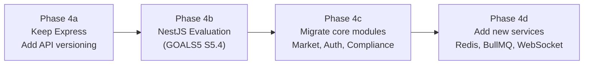
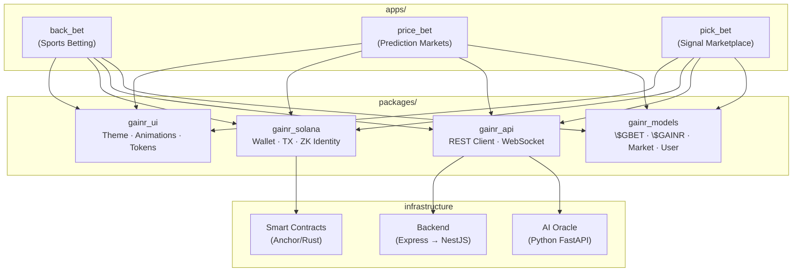

# GAINR Ecosystem — Flutter Consolidation & Backend Transformation Plan

> **Decision**: Consolidate all 3 dApps on Flutter (Dart), using Back.bet's approved design and tech stack as the reference architecture.

---

## 📐 Target Monorepo Structure

```
d:\mBITS\GAINR_Pred\Price\
├── apps/
│   ├── back_bet/              ← renamed from GAINR/frontend (existing, approved)
│   ├── price_bet/             ← NEW Flutter app (prediction market UI)
│   └── pick_bet/              ← NEW Flutter app (signal marketplace UI)
│
├── packages/
│   ├── gainr_ui/              ← shared design system (theme, tokens, animations)
│   ├── gainr_solana/          ← shared Solana SDK wrappers (wallet, TX builders)
│   ├── gainr_api/             ← shared API client (typed REST client for backend)
│   └── gainr_models/          ← shared data models ($GBET, $GAINR, Market, User)
│
├── backend/                   ← transformed from prediction-market-backend
├── smart-contracts/           ← existing prediction-market-smartcontract
├── ai-oracle/                 ← NEW Python FastAPI (gainr-ai-oracle)
│
├── documents/                 ← existing WIP docs
└── melos.yaml                 ← monorepo orchestration
```

---

## User Review Required

> [!IMPORTANT]
> **The existing code is NOT disturbed.** All new Flutter apps are created in fresh folders. The existing `GAINR/` folder is renamed (not modified). The existing `prediction-market-frontend/` and `prediction-market-backend/` remain untouched until the new versions are validated.

> [!WARNING]
> **Backend transformation**: The current Express.js backend *can* remain as-is initially — the Flutter apps will consume it via REST. However, the SRD (§5) and Roadmap (M2) specify **NestJS evaluation** for production. I recommend a phased migration: keep Express serving all 3 apps now, then migrate to NestJS alongside the GOALS5 Phase 5 backend architecture tasks.

---

## Phase 1: Monorepo Setup & Shared Packages

### What moves from Back.bet → `packages/`

| Back.bet File | Target Package | Rationale |
|:---|:---|:---|
| `core/theme/app_theme.dart` | `gainr_ui` | Dark theme, colors, typography — shared by all 3 apps |
| `core/animations/web3_effects.dart` | `gainr_ui` | Glassmorphism, glow, neon animations — brand identity |
| `core/utils/team_branding.dart` | `gainr_ui` | Team logos, colors — shared across betting UIs |
| `core/widgets/async_value_widget.dart` | `gainr_ui` | Riverpod async state widget — universal pattern |
| `core/services/mock_wallet_service.dart` | `gainr_solana` | Wallet connect, balance, sign TX — all apps need this |
| `features/wallet/models/wallet_state.dart` | `gainr_solana` | Wallet state model — shared across all apps |
| `features/wallet/providers/wallet_provider.dart` | `gainr_solana` | Wallet Riverpod provider — every dApp connects a wallet |
| `features/wallet/providers/tier_provider.dart` | `gainr_solana` | $GAINR fee tier logic — protocol-wide |
| `features/wallet/widgets/connect_wallet_button.dart` | `gainr_solana` | Connect button widget — identical UI across all apps |
| `features/wallet/widgets/deposit_modal.dart` | `gainr_solana` | USDC → $GBET deposit — protocol-level, shared |
| `features/wallet/widgets/withdraw_modal.dart` | `gainr_solana` | $GBET → USDC withdraw — protocol-level, shared |
| `core/services/sports_api_client.dart` | `gainr_api` | REST client pattern → generalized for all backend routes |

### What STAYS in `back_bet/` only

| File(s) | Reason |
|:---|:---|
| `core/math/probability_engine.dart` | Sports-specific (Poisson, Kelly Criterion) — not relevant to Price.bet or Pick.bet |
| `features/betting/` (all widgets, models, providers) | Sports betting UI — Back.bet exclusive feature |
| `features/home/` (layout, sidebar, nav) | App-specific navigation shell |
| `core/services/mock_event_service.dart` | Sports event mock data — Back.bet only |

---

## Phase 2: Create `price_bet/` Flutter App

### Features to implement (mapped from GOALS5 S6.x)

| Feature | Source Requirement | Shared Package Used |
|:---|:---|:---|
| Dark Mode + Glassmorphism | S6.1 | `gainr_ui` (AppTheme.darkTheme) |
| Wallet connect + deposit/withdraw | S1.2/S1.3 | `gainr_solana` |
| Market list (browse predictions) | S6.2 | `gainr_api` (market endpoints) |
| Prediction card (YES/NO) | S2.1 CPMM | App-specific widget |
| Bet placement via CPMM | S2.1 | `gainr_solana` (TX builder) |
| Cash out (sell shares) | S2.2 | `gainr_solana` (TX builder) |
| AI Insight Panel | S6.4 | `gainr_api` (AI oracle endpoint) |
| Candlestick probability charts | S6.2 | App-specific (fl_chart) |
| Real-time price updates | S5.2 WebSocket | `gainr_api` (WebSocket client) |
| zkMe identity verification | S3.1 | `gainr_solana` (shared ZK flow) |

### `price_bet/` pubspec.yaml dependencies

```yaml
dependencies:
  flutter: { sdk: flutter }
  gainr_ui: { path: ../../packages/gainr_ui }
  gainr_solana: { path: ../../packages/gainr_solana }
  gainr_api: { path: ../../packages/gainr_api }
  gainr_models: { path: ../../packages/gainr_models }
  flutter_riverpod: ^3.1.0
  riverpod_annotation: ^4.0.0
  go_router: ^17.1.0
  fl_chart: ^0.70.2          # candlestick/probability charts
  web_socket_channel: ^3.0.1  # real-time price updates
```

---

## Phase 3: Create `pick_bet/` Flutter App

### Features (mapped from GOALS5 S12.x)

| Feature | Source Requirement |
|:---|:---|
| Signal provider profiles | S12.1 |
| Copy-trade execution | S12.2 |
| Signal marketplace browse | S12.3 |
| Leaderboard + reputation | S12.1 |
| Staking for signal providers | S12.1 |

Uses the same shared packages (`gainr_ui`, `gainr_solana`, `gainr_api`, `gainr_models`).

---

## Phase 4: Backend Strategy (The Critical Question)

### Recommendation: **Phased Transformation, Not Big Bang**



| Phase | Action | Timeline |
|:---|:---|:---|
| **4a** (Now) | Keep Express backend, add `/api/v1/` prefix, add Flutter-friendly JSON responses. All 3 Flutter apps hit the same backend. | Week 1–2 |
| **4b** (GOALS5 S5.4) | NestJS evaluation — build one module (e.g., Market) in NestJS alongside Express to compare DX and performance | Weeks 6–10 |
| **4c** (If NestJS approved) | Migrate remaining modules: Auth (Guards), Compliance, Oracle, Referral, Profile | Weeks 10–16 |
| **4d** (GOALS5 S5.1–S5.3) | Add Redis cache, BullMQ job queue, WebSocket gateway — these are framework-agnostic and work with either Express or NestJS | Weeks 10–16 |

### Why NOT transform backend right now:
1. **Risk concentration** — changing both frontend AND backend simultaneously doubles risk
2. **Flutter apps need a stable API** to develop against — the existing backend serves that role
3. **NestJS migration is already tracked** in GOALS5 S5.4 — it belongs in the backend architecture phase, not the frontend consolidation phase

### What to ADD to the backend immediately:
- **CORS**: Allow Flutter web origins (`localhost:*` for dev, `*.gainr.bet` for prod)
- **API versioning**: `/api/v1/market/*`, `/api/v1/wallet/*` — so Flutter apps are decoupled from backend changes
- **OpenAPI spec**: Generate Swagger/OpenAPI JSON so `gainr_api` package can be auto-generated

---

## Code Sharing Architecture



---

## Monorepo Tooling: Melos

[Melos](https://melos.invertase.dev/) is the standard Flutter monorepo tool (used by Firebase, FlutterFire):

```yaml
# melos.yaml
name: gainr_protocol
packages:
  - apps/*
  - packages/*

scripts:
  analyze: melos exec -- dart analyze
  test: melos exec -- flutter test
  format: melos exec -- dart format .
  build:back: cd apps/back_bet && flutter build web
  build:price: cd apps/price_bet && flutter build web
  build:pick: cd apps/pick_bet && flutter build web
```

---

## Execution Order

| Step | Action | Est. Time |
|:---|:---|:---|
| 1 | Run backup script → create safety snapshot | 5 min |
| 2 | Rename `GAINR/` → `apps/back_bet/` | 5 min |
| 3 | Create `packages/gainr_ui/` — extract theme + animations from back_bet | 2–3 hrs |
| 4 | Create `packages/gainr_solana/` — extract wallet logic | 2–3 hrs |
| 5 | Create `packages/gainr_api/` — generalized REST client | 1–2 hrs |
| 6 | Create `packages/gainr_models/` — shared data models | 1 hr |
| 7 | Refactor `back_bet/` to consume shared packages (import paths change) | 2–3 hrs |
| 8 | Verify Back.bet still works with shared packages | 1 hr |
| 9 | Create `apps/price_bet/` — scaffold Flutter app with shared packages | 1 day |
| 10 | Build Price.bet core screens (market list, bet card, charts) | 1–2 weeks |
| 11 | Create `apps/pick_bet/` — scaffold Flutter app | 1 day |
| 12 | Set up `melos.yaml` for monorepo orchestration | 30 min |
| 13 | Update backend CORS + API versioning for Flutter clients | 2–3 hrs |

---

## Verification Plan

- **Back.bet unchanged**: After step 7–8, Back.bet must run identically to how it runs now
- **Shared packages**: Each package must have unit tests before being consumed
- **Price.bet comparison**: Side-by-side with existing Next.js Price.bet to verify feature parity
- `melos analyze` — zero errors across all apps and packages
- `melos test` — all tests pass


Status of this project as on 24-Feb-2026:

🚀 Strategic Vision: The "Multi-dApp" Ecosystem
The project is pivoting from separate repositories to a Unified Monorepo powered by Flutter. The goal is to build a vertically integrated 6-layer stack on Solana that shares liquidity and identity across three flagship products:

Back.bet: A Parimutuel sports betting engine (Reference architecture).
Price.bet: A trader-centric Prediction Market using CPMM (Binary YES/NO).
Pick.bet: A social "Signal Marketplace" for copy-trading strategies.
🏗️ Current Status: The "Foundational Pivot"
Architecture: You've successfully implemented a Monorepo structure (Melos) with shared packages (gainr_ui, gainr_solana, gainr_api, gainr_models). This is a high-standard move for scalability.
Frontend: back_bet is the most mature, serving as the benchmark for UI/UX (Terminal Aesthetic). price_bet has its scaffold but is in early feature-parity development.
Smart Contract: The $GBET Token-2022 mint logic is solid, but critical CPI mismatches exist in betting.rs and sell_shares.rs (legacy SPL Token calls) which will block trading.
Backend: The Express server is functional but "leaky." Key routes (referral, profile) lack signature verification, and the prediction.json private key exposure is a major blocker for production.
⚖️ The "Reality Gap" (Docs vs. Code)
Based on GOALS5.md and the SRD:

Compliance (S3.x): The "Break-Glass" enclave and real zkMe validation are still in "Placeholder" or "Needs Fix" status.
AI Oracle (S4.x): The "System 2" reasoning engine is currently a strategic goal; the Python microservice is not yet built.
Liquidity (S2.x): The PID-controlled AMM is partially implemented but requires a transition from f64 math to fixed-point u64 to prevent on-chain precision errors.
In Summary: The project has a world-class strategic blueprint and a stunning UI design system. The immediate hurdles are securing the backend, fixing Token-2022 CPI compatibility in the smart contracts, and transitioning from mock to live for the AI and Oracle services.