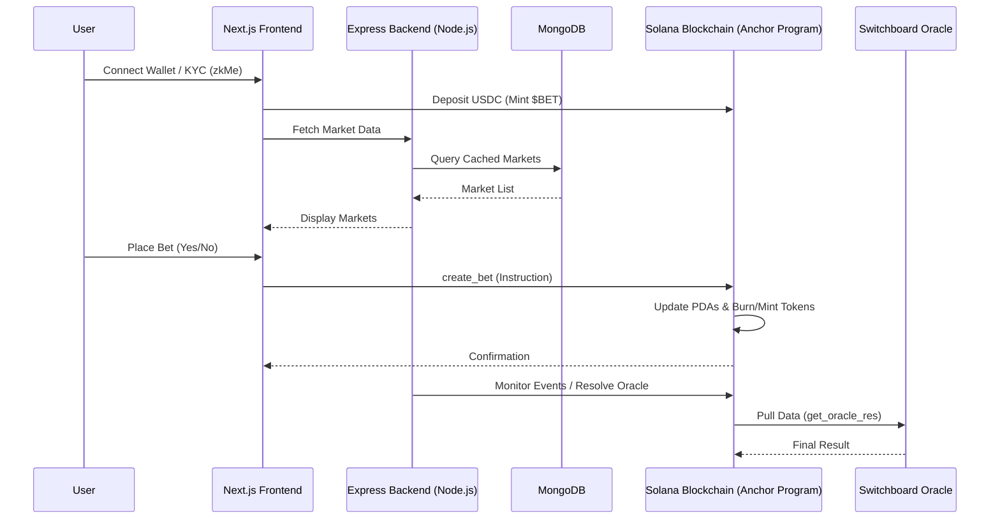
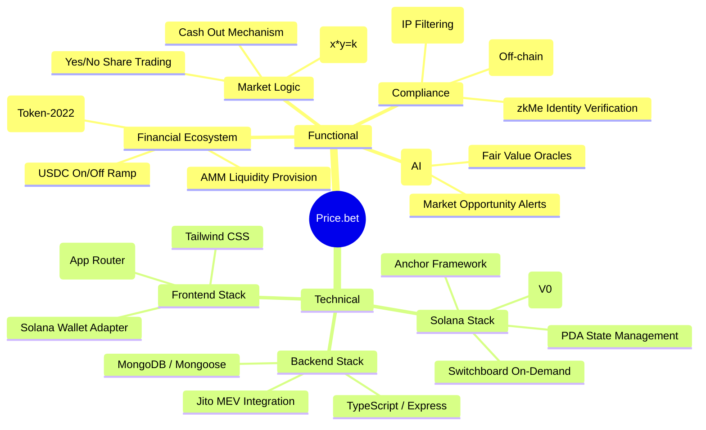

# Price.bet Architectural Analysis & Mindmap

This document provides a deep dive into the architecture of the Price.bet application, covering the frontend, backend, and smart contract layers. It also tracks progress against the `GOALS3.md` roadmap.

---

## 1. High-Level System Architecture

Price.bet operates as a decentralized prediction market where the frontend interacts with both a traditional backend (for data caching and social features) and the Solana blockchain (for value exchange and market logic).



---

## 2. Detailed Component Breakdown

### A. Smart Contract (Solana Anchor)
**Location**: `prediction-market-smartcontract`
The program manages the core financial logic and on-chain state.

```mermaid
graph TD
    subgraph State (PDAs)
        Global[Global Settings]
        Market[Market Account]
        BetMint[Token-2022 $BET Mint]
        ShareMint[Share Mint A/B]
    end

    subgraph Instructions
        init[initialize] --> Global
        create_market[init_market] --> Market
        deposit[deposit_usdc] --> BetMint
        bet[create_bet] --> ShareMint
        sell[sell_shares] --> ShareMint
        oracle[get_oracle_res] --> Market
    end

    Market -->|Switchboard| PullFeed[Switchboard Pull Feed]
```

### B. Backend (Express.js)
**Location**: `prediction-market-backend`
Acts as a middleware for compliance, market metadata caching, and oracle management.

```mermaid
graph LR
    subgraph API Surface
        R_Market[Market Router] --> C_Market[Market Controller]
        R_Profile[Profile Router] --> C_Profile[Profile Controller]
        R_Compliance[Compliance Router] --> C_Compliance[Compliance Controller]
        R_Oracle[Oracle Router] --> C_Oracle[Oracle Controller]
    end

    subgraph Logic Layer
        C_Market -->|Mongoose| M_Market[Market Model]
        C_Market -->|SDK| SDK[Prediction Market SDK]
        SDK -->|@solana/web3.js| Solana
    end
```

### C. Frontend (Next.js)
**Location**: `prediction-market-frontend`
A modern Web3 interface focused on speed and high-compliance (zkMe).

- **Routing**: Next.js App Router (`/fund`, `/propose`, `/profile`).
- **State Management**: `GlobalContext` (balances, market formatting), `ZKMeProvider` (identity verification).
- **Styling**: Tailwind CSS with Glassmorphism / Dark Mode (Pending).

---

## 3. Product Mindmap (Functional & Technical)



---

## 4. Roadmap Implementation Status (`GOALS3.md`)

| Phase | Task | Status | Technical Analysis / Blockers |
| :--- | :--- | :--- | :--- |
| **P1** | $BET Ecosystem | 🟢 | Fully implemented via `deposit_usdc` and `bet_mint_seed`. |
| **P2** | CPMM Engine | 🟢 | `betting.rs` and `sell_shares.rs` handle AMM math. |
| **P3** | Identity Layer | 🟢 | `ZKMeProvider.tsx` integrated in Frontend; `zkme_oracle_key` in Program. |
| **P4** | **AI Reasoning** | ⚪ | **Pending**. `registFeed` in backend is a placeholder. |
| **P5** | **Trading UI** | ⚪ | **Pending**. Core UI exists but lacks advanced charts/social ticker. |
| **P6** | **Hardening** | ⚪ | **Pending**. Performance tests (2,000 TPS) and full audit remaining. |

### ⚠️ Technical Blockers for Pending Items (Phase 4)
- **AI Oracle Bridge (S4.1)**: The backend `controller/oracle` is currently empty. Integration requires connecting GAINR's "System 2" AI models to the Switchboard `PullFeed` infrastructure.
- **Social Ticker (S5.3)**: Requires a backend WebSocket server or SSE to push real-time bet events from the blockchain to the UI.
- **TPS Hardening (S6.1)**: While Solana handles high TPS, the current backend caching layer (Express/Mongo) may need Redis horizontally scaled to support concurrent users during high-volatility events.

Textual Diagram:-

```text
+-------------------------------------------------------------+
|                      USER (Browser)                         |
|  +-------------------------------------------------------+  |
|  |           Next.js Frontend (Price.bet UI)             |  |
|  |  +---------------------+       +-------------------+  |  |
|  |  |   GlobalContext     | <---> |   ZKMeProvider    |  |  |
|  |  | (Balances/State)    |       | (Identity/KYC)    |  |  |
|  |  +---------------------+       +-------------------+  |  |
|  +-------------^---------------------------^-------------+  |
+----------------|---------------------------|----------------+
                 |                           |
        [REST API / JSON]            [JSON-RPC / Transactions]
                 |                           |
+----------------v------------+     +--------v----------------+
|      Express Backend        |     |    Solana Blockchain    |
|  +-----------------------+  |     |  +--------------------+ |
|  |  Market/Profile API   |  |     |  |   Anchor Program   | |
|  +-----------^-----------+  |     |  | (prediction_market)| |
|              |              |     |  +---------^----------+ |
|  +-----------v-----------+  |     |            |            |
|  |     MongoDB/Atlas     |  |     |  +---------v----------+ |
|  |   (Market Caching)    |  |     |  |  PDAs (Global/Mar) | |
|  +-----------------------+  |     |  +---------^----------+ |
+-----------------------------+     |            |            |
                                    |  +---------v----------+ |
                                    |  |  Switchboard On-Dem| |
                                    |  | (Price Feeds)      | |
                                    |  +--------------------+ |
                                    +-------------------------+
```
